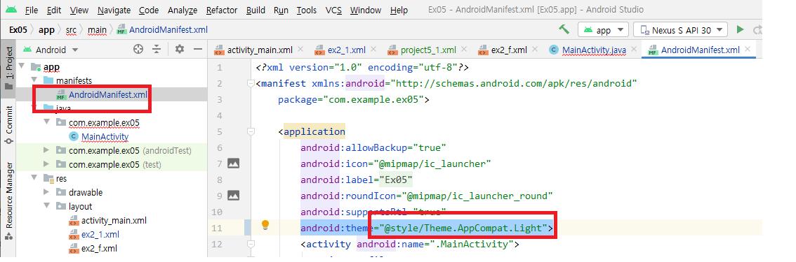
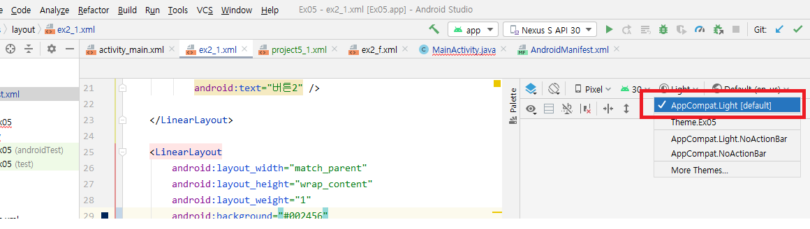
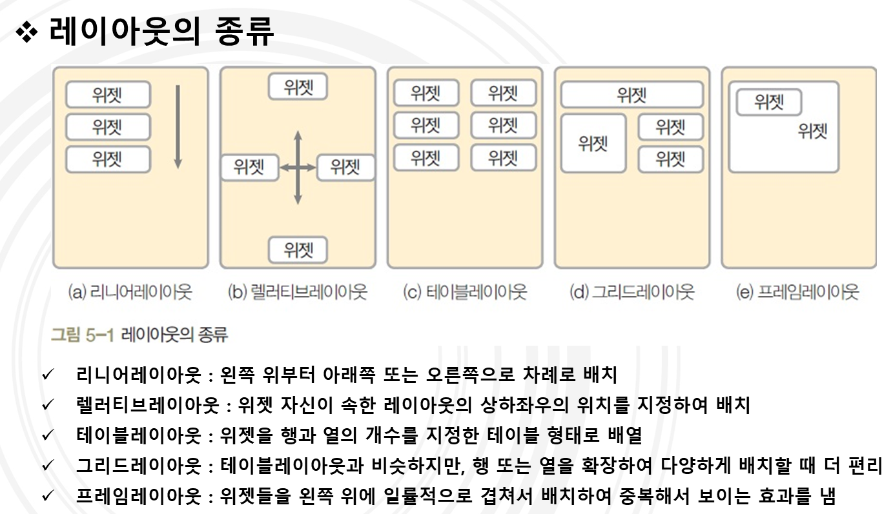

# Android study in BusanIT
#### 1. Android Studio How to Color


#### 2. Android layout list

#### 3. 0~1 숫자버튼 한번에 정의하기 + 이벤트 주기
```
Button[] numButtons = new Button[10];
Integer[] numBtnIDs = {R.id.btn0, R.id.btn1, R.id.btn2, R.id.btn3, R.id.btn4,
                    R.id.btn5, R.id.btn6, R.id.btn7, R.id.btn8, R.id.btn9};

for(i = 0 ; i<numBtnIDs.length ; i++) {
    numButtons[i] = (Button)findViewById(numBtnIDs[i]);}
```
```
for(i = 0 ; i<numBtnIDs.length ; i++) {
            final int index;
            index = i;
            numButtons[index].setOnClickListener(new View.OnClickListener() {
                @Override
                public void onClick(View v) {
                    if (et1.isFocused() == true) {
                        num1 = et1.getText().toString() + numButtons[index].getText().toString();
                        et1.setText(num1);
                    } else if (et2.isFocused() == true) {
                        num2 = et2.getText().toString() + numButtons[index].getText().toString();
                        et2.setText(num2);
                    } else {
                        Toast.makeText(getApplicationContext(),"텍스트에디트 선택하시오",Toast.LENGTH_SHORT).show();
                    }
                }
            });
        }
```